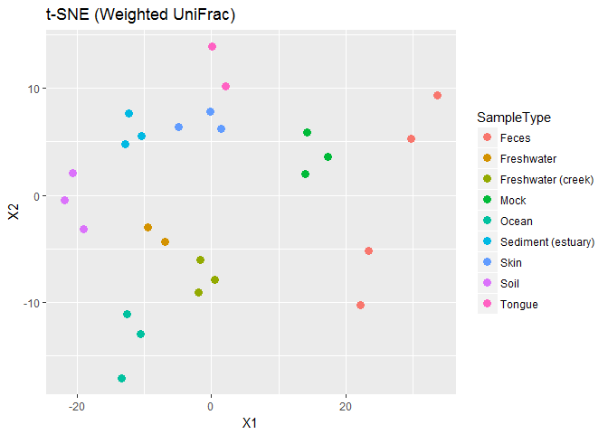

<!-- README.md is generated from README.Rmd. Please edit that file -->
tsnemicrobiota
==============

tsnemicrobiota implements the t-SNE ordination algorithm so that it can be used with microbiota data. t-SNE differ from other commonnly used ordination techniques in that it emphases *local* distances instead of *global* distances. One consequence of this is that some structure in the data, such as clusters, often can appear in a lower-dimensional space than what other techniques require.

The functions in this package is intended to be used together with the phyloseq package.

In addition to supporting the distance methods in phyloseq, you can also use the euclidean philr distances from the philr package.

Installation
------------

From inside R, the package can be installed from GitHub by using devtools.

``` r

library("devtools")
install_github("opisthokonta/tsnemicrobiota")
```

Example
-------

Here is how you can use t-SNE on the GlobalPatterns data set using weighted UniFrac.

``` r
library(phyloseq)
library(tsnemicrobiota)
library(ggplot2)

# Load the data
data("GlobalPatterns")

tsne_res <- tsne_phyloseq(GlobalPatterns, distance='wunifrac',
    perplexity = 8, verbose=0, rng_seed = 3901)

# Plot the results.
plot_tsne_phyloseq(GlobalPatterns, tsne_res,
    color = 'SampleType', title='t-SNE (Weighted UniFrac)') +
    geom_point(size=3)
```



Compared with the results with PCoA we see that t-SNE better separates the samples from different SampleTypes.

``` r
pcoa_res <- ordinate(GlobalPatterns, method='PCoA', distance = 'wunifrac')

plot_ordination(GlobalPatterns, pcoa_res, color='SampleType', title='PCoA (Weighted UniFrac)') + 
    geom_point(size=3)
```


